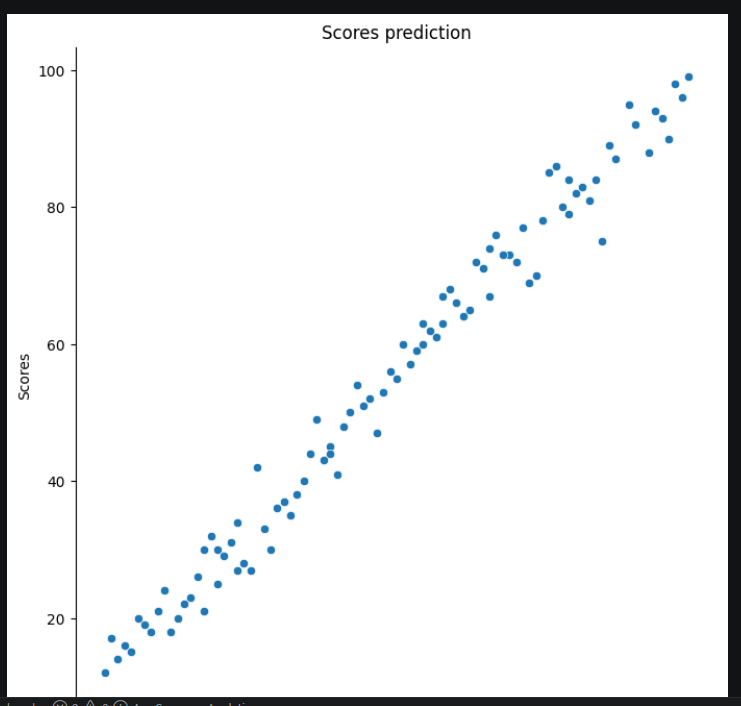
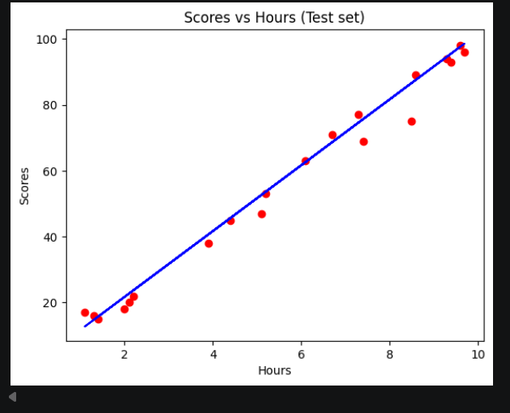
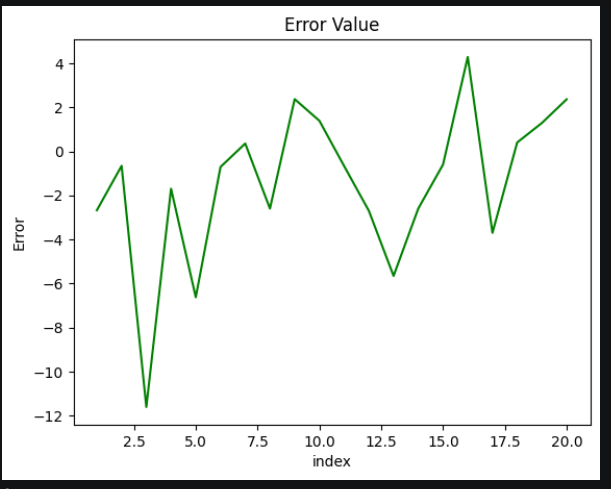

# 🎓 Student Performance Prediction Model

This project implements a **Simple Linear Regression** model to predict student scores based on their study hours. It demonstrates the entire machine learning pipeline from data preprocessing to model evaluation, transforming raw data into a predictive tool.

## 🚀 Project Workflow
1. **Data Inspection:** Initial analysis of the dataset structure and statistical distribution.
2. **Data Visualization:** Using scatter plots to visualize the relationship between study hours and exam scores.
3. **Model Training:** Splitting data into training and testing sets, and fitting the Linear Regression model.
4. **Evaluation:** Analyzing the regression line, calculating error rates, and verifying model performance.

## 📊 Key Results
The model demonstrated high predictive accuracy:
* **R-Squared Score:** `0.9836` (indicating the model explains 98.36% of the variance in scores).
* **Mean Squared Error:** `14.52`.
* **Model Equation:** Score = $9.98 \times (\text{Hours}) + 1.72$.

## 🖼️ Visualizations

| Raw Data Analysis | Training Set Regression |
| :--- | :--- |
|  |  |

| Test Set Performance | Error Analysis |
| :--- | :--- |
|  |  |

## 🛠️ Tools & Technologies
* **Python:** Core programming language.
* **Libraries:** `pandas` (data manipulation), `seaborn` & `matplotlib` (visualization), `scikit-learn` (machine learning model development).
* **Environment:** Jupyter Notebook / VS Code.
